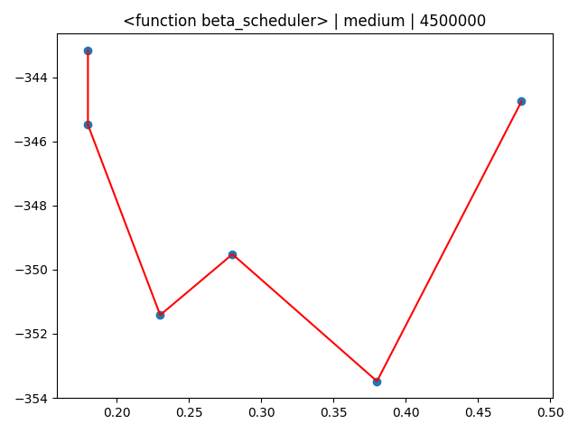
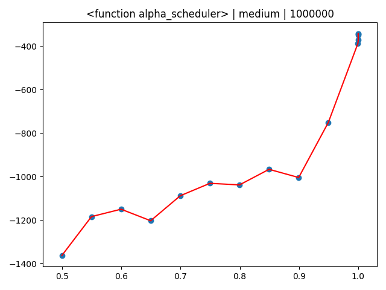
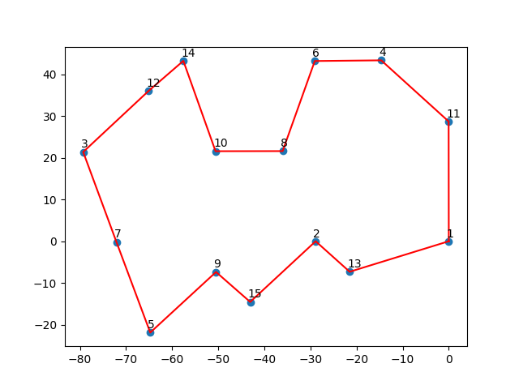
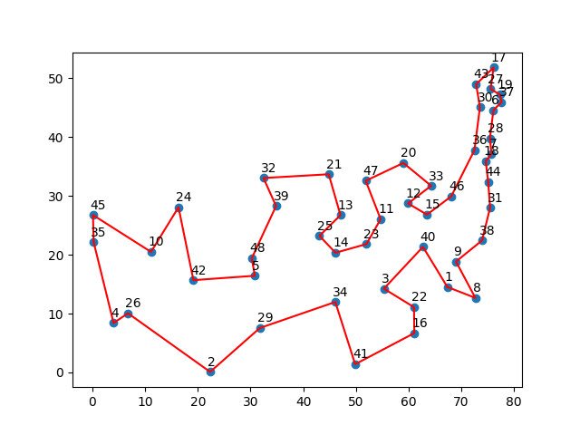
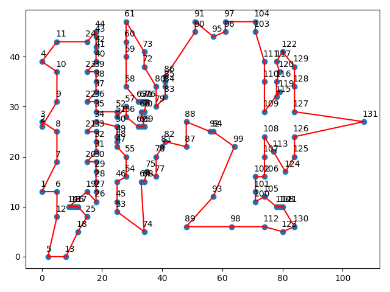

### **Simulated Annealing - Algorithm Implementation**  
Problem Definition:
Initial State: Randomly state of N ordered elements.  
(Example for TSP: input can be N cities, each city has (x,y) coordinate - randomly ordered)  
Operator: Swapping of 2 Elements in the state, under the probability P.  

Let variables:

|func                |def                          |Desc                         |
|----------------|-------------------------------|-----------------------------|
|P|`If Loss<0, 1 Else, e^(loss/temp)`|Probability for swapping between 2 elements|
|Loss          |`energy(new state) – energy(state)`|Cost function of an operation|
|Energy          |`Value of the current state (must be define)`|Value of state|
|Steps          |`Value of the current state (must be define)`|How many iterations|
|Temp(0)          |`Value of the current state (must be define)`|Initial Temperature|
|A scheduler|`T(i)= 1 /(T(0)+beta*i), beta>0`|Temperature at time i by A scheduler|
|B scheduler          |`T(i)=T(0)*alphai, 0<alpha<1`|Temperature at time i by B scheduler|

**Motivation**: System start with a given temperature, and starts to randomly choose 2 elements  
swapping them under discussed conditions even when loss its negative.  
after a while, the temperature is getting decrease, and the probability for taking wrong operations is also decreasing.  
In the end, the probability for taking unworthy operations is tending to Zero.  
the final result will be a good approximation to the optimized solution.

**Algorithm**:  
- for **steps** iterations:
    - 1. current **temperature** <- scheduler calculation.
    - 2. get suggested new state after random operation.
    - 3. if **Done** (temp is equal to/ tend to Zero)
        - break
    - 4. if **P** almost Zero.
        - remember suggested state.
    - 5. **Loss** calculation.
    - 6. System State Update.
            - if **Loss** > 0
                - execute suggested operation.
            - Else
                - calculate **P**=e^(loss/temp)
                - take an unworthy step with probability **P**
    
**_TSP Example_**:  
Problem Definition:  
Initial State: Randomly state of N ordered cities (each city has (x, y) coordinates).  
Operator: Swapping of 2 Elements in the state, under the probability P.  
Let **Energy**=Eulerian Path Distance Sum of the given state.  
Goal - To find the shortest path. (minimum negative energy)  

*Inputs are given in the project, in tsp_problems - also the params that I gave to the Algorithm.  

influence of A and B schedulers params:  
X - Value of alpha/beta.
Y - **Energy** of the system after some problem solving.  
plot format :(scheduler | problem scale | iterations)

Outputs:  
15 cities

48 cities

15 cities
